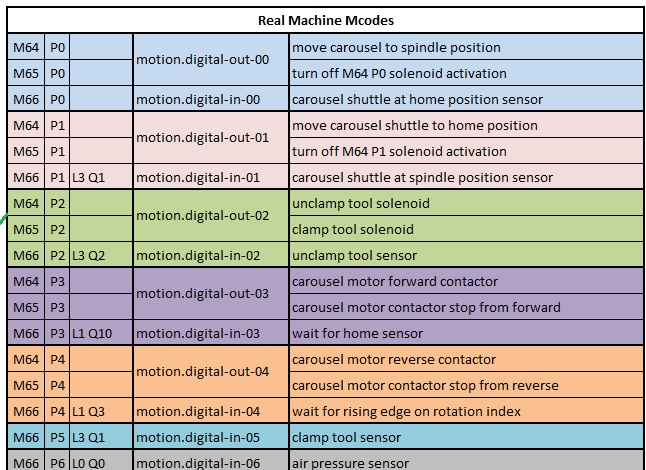

============
Carousel ATC
============

**Work In Progress**

.. image:: images/mill/atc.png

Carousel ATC Implementation
---------------------------
**TODO** Details about how the Probe Basic Carousel ATC has been implemented.

Setup
-----

Step 1: INI File Changes
~~~~~~~~~~~~~~~~~~~~~~~~
In your text editor, open the you machine config INI file.

[PYTHON] Section
^^^^^^^^^^^^^^^^

Add or update the ``[PYTHON]`` section as below. The ``python`` folder should have been copied into you machine config directory when you setup your Probe Basic machine config. This folder should include the needed files. ``toplevel.py``, ``remap.py`` and ``stdglue.py``

.. code:: ini

    [PYTHON]
    TOPLEVEL = ./python/toplevel.py
    PATH_APPEND = ./python/
    #LOG_LEVEL = 8

[ATC] Section
^^^^^^^^^^^^^

Add the following ``[ATC]`` section to your INI file.
These 4 settings are used to configure the Carousel ATC

POCKETS:
    | This sets the number of pockets in your carousel.
    | Probe Basic supports 8, 10, 12, 14, 16, 18, 20, 21 and 24 pocket configurations.
    | Setting this value to ``0`` will hide the ATC tab in the Probe Basic UI.
Z_TOOL_CHANGE_HEIGHT:
    | This value should be set the Z height, in machine confidantes (G53), your spindle need to be at to clamp/unclamp a tool form the ATC.
    | If not specified the included routines will use the value of ``-3.90``
Z_TOOL_CLEARANCE_HEIGHT:
    | This value should be set the Z height, in machine confidantes (G53), your spindle needs to be at to safely clear the ATC carousle and holders.
    | Typically this is Z max or just under ``-0.1``.
    | If not specified the included routines will use the value from [AXIS_Z]MAX_LIMIT minus 0.1
STEP_TIME:
    | Step Time should be set to the approximate time it takes your ATC to rotate between pocket (in ms)
    | This just adjust the speed of the ATC tab Carousel GFX rotation (default if omitted is 1000ms)

.. code:: ini

    [ATC]
    # Probe Basic supports 8, 10, 12, 14, 16, 18, 20, 21, 24 pocket configurations.
    # Set to 0 to hide the ATC tab in the UI.
    POCKETS = 12
    # The Z height you spindle needs to be at to clamp/unclamp a tool form the ATC.
    Z_TOOL_CHANGE_HEIGHT = -3.9000
    # The Z clearance height you spindle needs to be at to safely clear the ATC.
    Z_TOOL_CLEARANCE_HEIGHT = -0.1
    # Step Time should be set to the approximate time it takes your ATC to rotate between pocket (in ms)
    # This just adjust the speed of the ATC tab Carousel GFX rotation (default if omitted is 1000ms)
    STEP_TIME = 500

[RS274NGC] Section
^^^^^^^^^^^^^^^^^^

Add the following ``REMAP`` line to the ``[RS274NGC]`` section.

.. code:: ini

    [RS274NGC]
    ...

    REMAP=M6   modalgroup=6 prolog=change_prolog ngc=toolchange epilog=change_epilog
    REMAP=M10  modalgroup=6 argspec=P ngc=m10
    REMAP=M11  modalgroup=6 argspec=p ngc=m11
    REMAP=M12  modalgroup=6 argspec=p ngc=m12
    REMAP=M13  modalgroup=6 ngc=m13
    REMAP=M21  modalgroup=6 ngc=m21
    REMAP=M22  modalgroup=6 ngc=m22
    REMAP=M23  modalgroup=6 ngc=m23
    REMAP=M24  modalgroup=6 ngc=m24
    REMAP=M25  modalgroup=6 ngc=m25
    REMAP=M26  modalgroup=6 ngc=m26

Step 2: HAL Setup
~~~~~~~~~~~~~~~~~

.. important::
    **TODO:** This section is a work in progress

+--------+-----+------------+-----------------------+---------------------------------------------+
| M Code | Pin | Input Mode | HAL Pin               | Description                                 |
+========+=====+============+=======================+=============================================+
| M64    | P0  |            | motion.digital-out-00 | Move carousel to spindle position           |
+--------+-----+------------+                       +---------------------------------------------+
| M65    | P0  |            |                       | Turn off M64 PO solenoid activation         |
+--------+-----+------------+-----------------------+---------------------------------------------+
| M66    | P0  | L3 Q1      | motion.digital-in-00  | Carousel shuttle at home position sensor    |
+--------+-----+------------+-----------------------+---------------------------------------------+
| M64    | P1  |            | motion.digital-out-01 | Move carousel shuttle to home position      |
+--------+-----+------------+                       +---------------------------------------------+
| M65    | P1  |            |                       | Turn off M64 P1 solenoid activation         |
+--------+-----+------------+-----------------------+---------------------------------------------+
| M66    | P1  | L2 Q2      | motion.digital-in-01  | Carousel shuttle at spindle position sensor |
+--------+-----+------------+-----------------------+---------------------------------------------+
| M64    | P2  |            | motion.digital-out-02 | Unclamp tool solenoid                       |
+--------+-----+------------+                       +---------------------------------------------+
| M65    | P2  |            |                       | Clamp tool solenoid                         |
+--------+-----+------------+-----------------------+---------------------------------------------+
| M66    | P2  | L1 Q10     | motion.digital-in-02  | Unclamp tool sensor                         |
+--------+-----+------------+-----------------------+---------------------------------------------+
| M64    | P3  |            | motion.digital-out-03 | Carousel motor forward contactor            |
+--------+-----+------------+                       +---------------------------------------------+
| M65    | P3  |            |                       | Carousel motor contactor stop from forward  |
+--------+-----+------------+-----------------------+---------------------------------------------+
| M66    | P3  | L1 Q3      | motion.digital-in-03  | Wait for home sensor                        |
+--------+-----+------------+-----------------------+---------------------------------------------+
| M64    | P4  |            | motion.digital-out-04 | Carousel motor reverse contactor            |
+--------+-----+------------+                       +---------------------------------------------+
| M65    | P4  |            |                       | Carousel motor contactor stop from reverse  |
+--------+-----+------------+-----------------------+---------------------------------------------+
| M66    | P4  | L1 Q3      | motion.digital-in-04  | Wait for rising edge on rotation index      |
+--------+-----+------------+-----------------------+---------------------------------------------+
| M66    | P5  | L3 Q1      | motion.digital-in-05  | Clamp tool sensor                           |
+--------+-----+------------+-----------------------+---------------------------------------------+

Carousel ATC Operation
----------------------

.. important::
    **TODO:** This section is a work in progress
