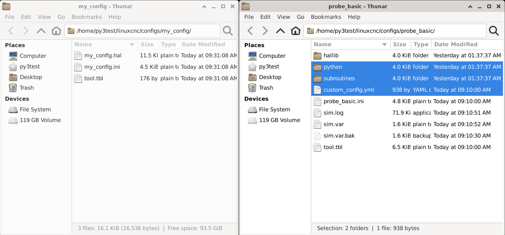
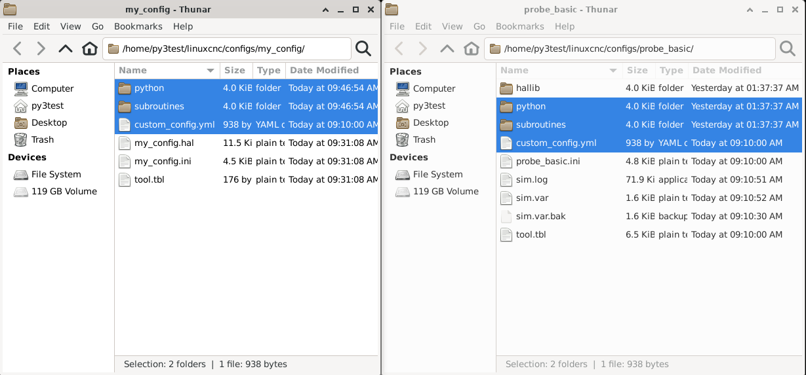
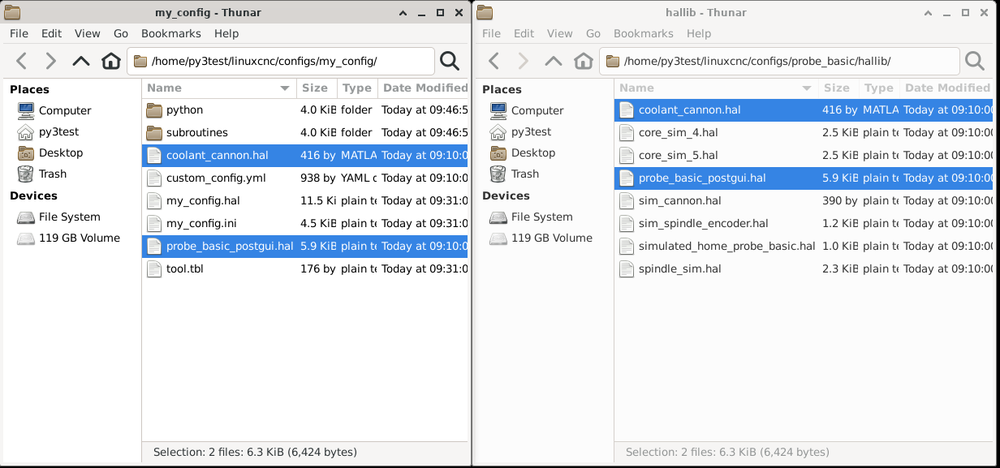
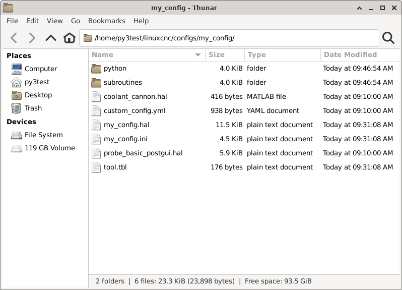
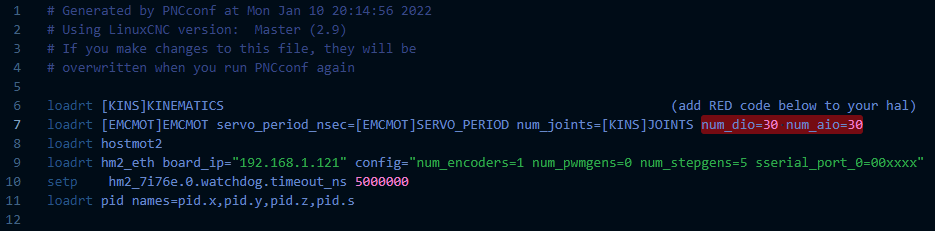
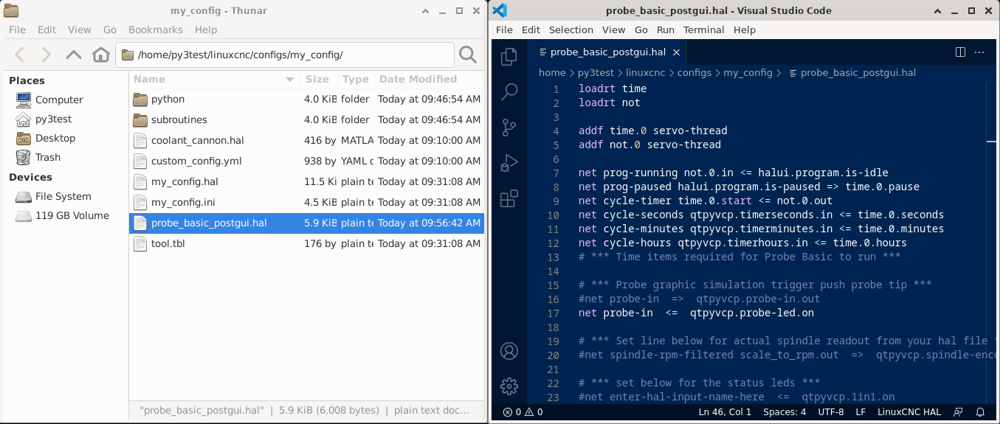

===================================
Machine Configuration (INI and HAL)
===================================

The steps below are intended to help converting a Stepconf/Pncconf config over to a working Probe Basic Config.

These step do not include the needed changes to setup an ATC, once completing the steps below you will also need to follow :doc:`atc_setup`, if needed.

Step 1: Installation
--------------------
From a running Debian 12 Bookworm Installation you can follow either the deb or apt instruction to install Probe Basic:

| :doc:`APT Installation instructions <quick_start_apt>`
| :doc:`.deb Installation instructions <quick_start>`

Once installed Probe Basic will have placed three simulation configs into your ``~/linuxcnc/configs/`` folder

* ``atc_sim`` This contains two, imperial and metric, 3 axis machine simulations that include a vismach model with ATC.
* ``probe_basic`` This contains a basic 5 axis machine simulation with out ATC.
* ``probe_basic_lathe`` This contains a lathe machine simulation.

Step 2: Working Machine Config
------------------------------
Create a configuration for your machine using Stepconf, Pncconf or mesact/mesact2 from the linuxcnc menu in the applications drop down in the upper menu bar In this example we are using pncconfig. It is recommended to use the Axis gui display for this initial build.  You should have your machine's wiring schematic premade to make filling in the required information fast, easy and accurate in Pncconf.

After you have completed the Pncconf configuration builder and have created a new machine configuration that has been saved in the linuxcnc config directory, it is advised that you start linuxcnc using your new config to verify there are no errors. It is also advisable to test the machine to verify the base functionality is correct, for example, jogging, spindle function, axis motion is as expected and the commanded distance matches the actual distance moved, and any other sort any gremlins prior to making the switch to probe basic.  This will ensure when you transition it goes smoothly.  Once completed and found to function correctly, you can proceed to the next step.

Step 3: Initial File Copy
-------------------------
In the ``~/linuxcnc/`` config folder, there should now be a folder for your machine config, the output of Pncconf, and there should also be the ``probe_basic`` config folder. Both will be used for copying required files over to the new machine config folder.

Open two windows in the file tree, the new machine config folder and the ``probe_basic`` config folder. Copy the highlighted files (two folders and one file) shown below from the probe basic config folder to the your machine config folder.

What is shown will be the minimum starting point for the config conversion for Probe Basic:

Above you can see that we removed any unnecessary files and folders from the machine config, simplify things for converting to probe basic. If you have a special case for having certain files then please use your discretion in leaving the required files for your use.

After the copy, your machine config folder should now look something like this.

Step 4: HAL File Copy
---------------------
In the ``probe_basic`` config folder, open the ``hallib ``folder. Copy over the two highlighted files as shown in the below image:

Your machine config folder should now look like this and have the required files in it:

Step 5: INI File Changes
------------------------
In your text editor, open the new machine config ini file. In the example it is named my_config.ini, the below ini changes are required for probe basic and should be present in your machine configuration for full functionality.

[DISPALY] Section
~~~~~~~~~~~~~~~~~
Change the ``DISPLAY`` line to ``probe_basic`` and add the two lines for ``CONFIG_FILE`` and ``FULLSCREEN`` as below.

On the ``INCREMENTS`` line add ``JOG`` at the start

.. code:: ini

   [DISPLAY]
   DISPLAY = probe_basic
   CONFIG_FILE = custom_config.yml
   FULLSCREEN = True
   ...
   INCREMENTS = JOG .1in .01in .001in .0001in
   ...

.. note::
    Your ``INCREMENTS``, after ``JOG``, may be different if you have a metric machine.

[RS274NGC] Section
~~~~~~~~~~~~~~~~~~
Add the ``F10 S300`` to the start of the ``RS274NGC_STARTUP_CODE`` line.

Add the three lines ``OWORD_NARGS``, ``NO_DOWNCASE_OWORD`` and ``SUBROUTINE_PATH`` as below.

.. code:: ini

   [RS274NGC]
   PARAMETER_FILE = linuxcnc.var
   RS274NGC_STARTUP_CODE = F10 S300 G20 G17 G40 G49 G54 G64 P0.001 G80 G90 G91.1 G92.1G94 G97 G98
   OWORD_NARGS = 1
   NO_DOWNCASE_OWORD = 1
   SUBROUTINE_PATH = subroutines/

.. note::
    Ensure that ``RS274NGC_STARTUP_CODE`` includes either G20 for a imperial machine or G21 for a metric machine.

[HAL] Section
~~~~~~~~~~~~~
Change the ``POSTGUI_HALFILE`` line to ``probe_basic_postgui.hal``.

.. code:: ini

   [HAL]
   HALUI = halui
   HALFILE = (your_config_halfile_name_here).hal
   POSTGUI_HALFILE = probe_basic_postgui.hal

.. note::
   Your machine config folder may contain a ``custom_postgui.hal`` file, any needed entries you have made in there should be copied over to ``probe_basic_postgui.hal`` in step 7.

Step 6: HAL File Changes
------------------------
In the text editor, open your machine hal file, show in the example as my_linuxCNC_machine.hal. Probe basic may use additional dio and aio for its various subroutines and macros, the count of these needs to be added to the hal file by editing/adding to the line ``loadrt [EMCMOT]EMCMOT`` as shown in the below image:

**TODO:** Detail changes needed for manual tool change dialogue

.. code::

 # in case they were linked already
 unlinkp iocontrol.0.tool-change
 unlinkp iocontrol.0.tool-changed
 unlinkp iocontrol.0.tool-prep-number
 unlinkp iocontrol.0.tool-prepare
 unlinkp iocontrol.0.tool-prepared

 #  ---manual tool change signals---
 net tool-change-request    <= iocontrol.0.tool-change
 net tool-change-confirmed  => iocontrol.0.tool-changed
 net tool-number            <= iocontrol.0.tool-prep-number

 #  ---ignore tool prepare requests---
 net tool-prepare-loopback   iocontrol.0.tool-prepare => iocontrol.0.tool-prepared

Step 7: Post GUI HAL Changes
----------------------------
The ``probe_basic_postgui.hal`` file that was copied in step 4 is based on the Probe Basic simulation machine and needs edits to convert from the sim required file to your machine postgui halfile.

.. note::
    Only one postgui halfile can be used so any post gui hal entries you may need should be incorporated into this file or there will be conflicts.

The first edit is to comment out (prepend ``#``) or delete the line:

.. code::

    net probe-in => qtpyvcp.probe-in.out

This line is only used in sim for development of probing routines and cannot be used in a machine configuration.

The second edit is to remove the connection to the spindle encoder if one is not used.

.. code::

    net spindle-rpm-filtered scale_to_rpm.out => qtpyvcp.spindle-encoder-rpm.in

If you are using a spindle encoder, you can edit this line to match the output from your configuration file which will give you the option in probe basic to select it as the spindle speed DRO rpm source. The user selection to change between software calculated rpm display and actual encoder display is on the settings page in probe basic. To comment out and leave in the file for future use simply enter the ``#`` symbol in front of the line as shown below.

Step 8: Finished
----------------
As long as the information you entered in the StepConf/Pncconf config builder is correct, this should now give you a working probe basic installation that will run your machine.
